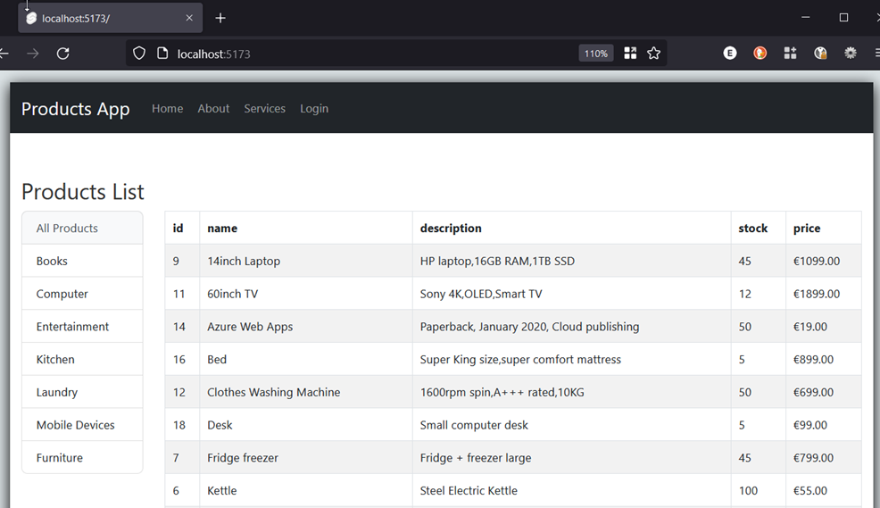
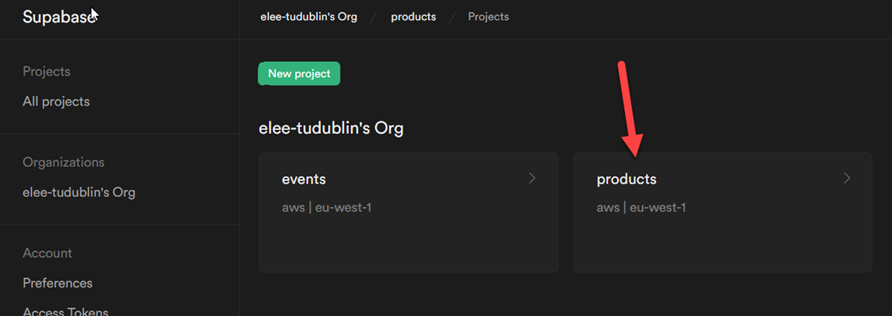
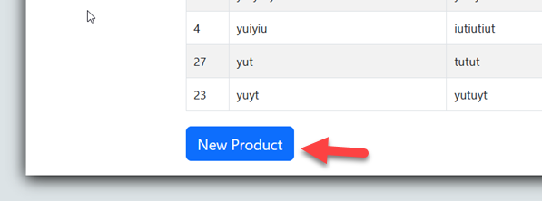
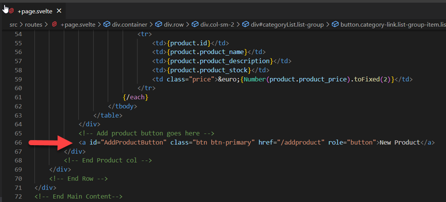
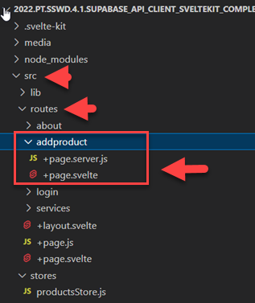
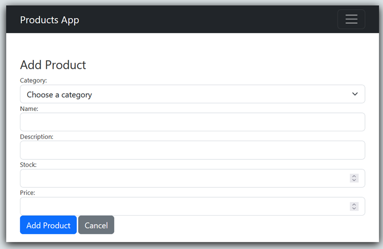
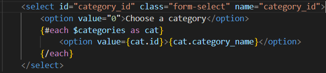
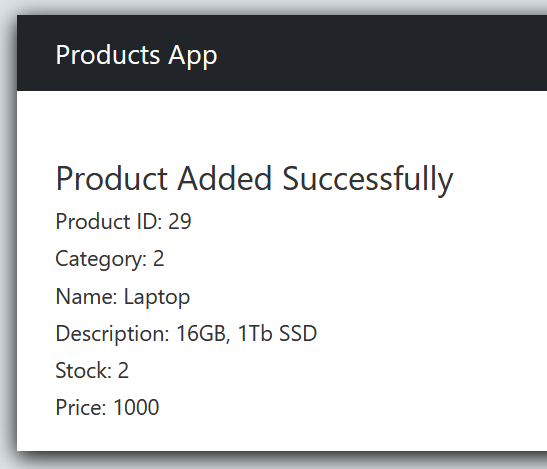
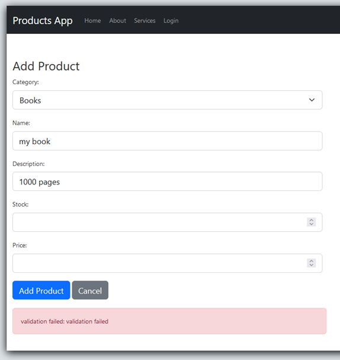

# Web API SvelteKit Client: Add a new Product

Enda Lee 2022

### Quick Start

1. Download or `fork` the start site from this repository.
2. Open in VS Code.
3. copy `sample.env` to `.env` and configure for your database.
4. In a terminal run `npm install`
5. Start the application using `npm run dev`


## Introduction

In this tutorial you will add new products the Database via an **`HTTP POST`** request to the API. The body of the POST request will include the values for a new product which need to be validated and inserted.

The web API (Supabase) will use SQL commands to accomplish the above but that will be hidden from users of the API who will only see the HTTP interface.

When http://localhost:5173 loads first, the empty default page looks like the following. 




This page shows the current list of products (and categories). This lab will enable new products to be added via a form.


## 1. Pre-requisites

The application will use **separate** **`client`** and **`server`** applications which should be opened in separate VS Code instances when working on this lab.

##### Server-side

Make sure that your Supabase database instance is setup and running




The client site/ application will fetch its data from the server-side API running on http://localhost:5001


## 2. Add a new Product via the form

#### 2.1. Show the form when the Add Product button is clicked

The button will be displayed under the products list:





Open the home page, `src/routes/routes/+page.svelte`, add a button link:




```html
<a id="AddProductButton" class="btn btn-primary" href="/addproduct" role="button">New Product</a>
```


#### 2.2  The form page and route

You can see that the button links to `/addproduct`. Add this route to the `routes` folder:

1. Add a new subfolder named after the route `addproduct`.
2. Add the svelte client page `+page.svelte`
3. Add a svelte server script `+page.server.js`   




##### The form (`+page.svelte`)

This is a **Bootstrap 5** styled form, which will look like this when displayed:



```html
<!-- Main Content - Products etc. -->
		<div class="row">
			<!-- Page Header -->
			<h2 class="mt-5">Add Product</h2>
		</div>

		<div class="row">
			<!-- Product Form -->
			<form
                <!-- POST method supports sending form data in request body -->
			 	method="POST"
            	<!-- This is where data will be sent when the form is submitted -->
			 	action="?/addproduct"
			 >
				<div class="row mb-3">
					<label for="category_id" class="form-label">Category:</label>
					<div class="col-sm-8">
						<select id="category_id" class="form-select" name="category_id">
							<option value="0">Choose a category</option>
							{#each $categories as cat}
								<option value={cat.id}>{cat.category_name}</option>
							{/each}
						</select>
					</div>
				</div>
				<div class="row mb-3">
					<label for="product_name" class="form-label">Name:</label>
					<div class="col-sm-8">
						<input 
							id="product_name" 
							type="text" 
							class="form-control" 
							name="product_name" 
							value=""
						/>
					</div>
				</div>
				<div class="row mb-3">
					<label for="product_description" class="form-label">Description:</label>
					<div class="col-sm-8">
						<input
						id="product_description"
						type="text"
						class="form-control"
						name="product_description"
						value=""
					/>
					</div>
				</div>
				<div class="row mb-3">
					<label for="product_stock" class="form-label">Stock:</label>
					<div class="col-sm-8">
						<input 
							id="product_stock" 
							type="number" 
							class="form-control" 
							name="product_stock" 
							value="" 
						/>
					</div>
				</div>
				<div class="row mb-3">
					<label for="product_price" class="form-label">Price:</label>
					<div class="col-sm-8">
						<input
							id="product_price"
							type="number"
							min="0.00"
							max="10000.00"
							step="0.01"
							class="form-control"
							name="product_price"
							value=""
						/>
					</div>
				</div>
				<!-- productId is a hidden field value is not required but set = 0-->
				<input id="id" type="hidden" value="0" />
				<div class="mb-3">
					<button type="submit" class="btn btn-primary"> Add Product </button>
					<a href="/" class="btn btn-secondary"> Cancel </a>
				</div>
			</form>
			<!-- End form-->
		</div>
</div>
```


The category select box must be filled so that they can be selected. Add the follow script block at the top to import `categories` from the `product store`

```javascript
<script>
	import { categories, getAllCategories } from '../../stores/productsStore.js';

	// Update list of categories (used in form)
	getAllCategories();
</script>
```


The `{#each}{/each}` block to add an option for each category is already included in the HTML:




## 3. Saving a new product

The Add Product form has two attributes which define what happens after the **Add Product ** button is clicked.

1. **`method="POST"`** will result in a `POST` request to the server with the form data contained in the body of the request.
2. **`action="?/addproduct"`** defines the form `action` - the script/ function which will handle the data sent.


#### 3.1 The `addproduct` `action handler` 

This is defined in the server-side script`addproduct/+page.server.js`

This script doe the following:

1. Import dependencies
2. Define the `addProduct` form `action`. This code executes when the form is submitted

`addProduct` doe the following:

1. Read the `formData` - sent in the request body (as it an HTTP POST)
2. Validate the data
3. If validation successful call `addNewProduct(product)` passing the valid product. Afterwards return the successful result
4. If validation fails, return an error result.

Read the comments for details. 

```javascript
// Import sveltekit dependencies
// @ts-ignore
import { invalid, redirect } from "@sveltejs/kit"

// Import addNewProduct function from the product store
import {addNewProduct} from '../../stores/productsStore';

// The form action handler(s)
export const actions = {

  // This is where the form sends its data
  // @ts-ignore
  addproduct: async ({request }) => {
    // @ts-ignore
    let success = false;

    // get data from the POST request
    const form_data = await request.formData();

    // read each value
    const product = {
      category_id: Number(form_data.get('category_id')),
      product_name: form_data.get('product_name'),
      product_description: form_data.get('product_description'),
      product_stock: Number(form_data.get('product_stock')),
      product_price: Number(form_data.get('product_price'))
    }

    // Basic validation check
    if (product.category_id > 0 &&
        product.product_name != '' &&
        product.product_description != '' &&
        product.product_stock > 0 &&
        product.product_price > 0
    ) {
        // Add the new product to Supabase
        const result = await addNewProduct(product);
        console.log('add product result: ', result)

      // If validation passed - return the result
      // This is a JS object containing the success state, a message, and a copy of the newly added product (from Supabase)
      return { 
        success: true,
        // The following annotation is to ignore TypeScript Syntax errors detected by ESLint and the Svelte VS Code extensions
        // @ts-ignore
        message: `New product added with id: ${result[0].id}`,
        // @ts-ignore
        product: result[0]
      };
      // If va;idation failed
      // Return a response with Status 400
      // set error state, a message, and return product (a copy of the form data) 
    } else {
      return invalid(400, {
        error: true,
        message: 'validation failed',
        product: product
      })
    }
  }
};
```


#### 3.2 The `addNewProduct()` function from `stc/store/productsStore.js`

```javascript
// Function to call Supabase and insert a row
// @ts-ignore
export const addNewProduct = async (new_product) => {
    const { data, error } = await supabase
    .from('product')
    .insert([
        { category_id: Number(new_product?.category_id), 
          product_name: new_product?.product_name,
          product_description: new_product?.product_description,
          product_stock: Number(new_product?.product_stock),
          product_price: Number(new_product?.product_price)
         },
    ])
    // Select the newly inserted product (so that it can be returned)
    .select();
    
    if(error) {
        return console.error(error);
    }

    // return inserted product
    return data;
}
```


#### 3.3 Show the result of insert in  the `addform` page

The form page is reloaded after the product is inserted so the result can be displayed. Note the `<script>` block changes from 2.2 above and also the `{#if} {:else} {/if}` block to control whether the result or form is displayed.


```html
<script>

	// Sveltekit form enhancements
	import { enhance, applyAction } from '$app/forms';

	// Import the store etc.
	import { categories, getAllCategories } from '../../stores/productsStore';

	// Access data returned from +page.server.js
	// @ts-ignore
	export let data;

	// Access data returned from +page.server.js
	// @ts-ignore
	export let form;

	// Update list of categories (used in form)
	getAllCategories();
</script>

<!-- Main Content - Products etc. -->
<div class="container">
	<!-- If the insert was sucessfull display the new product details-->
	{#if form?.success}

		<div class="row">
			<!-- Page Header -->
			<h2 class="mt-5">{form?.message}</h2>
		</div>

		<div class="row">
			<div class="row mb-3">
				<h6>Product ID: {form?.product.id}</h6>
			</div>
			<div class="row mb-3">
				<h6>Category: {form?.product.category_id}</h6>
			</div>
			<div class="row mb-3">
				<h6>Name: {form?.product.product_name}</h6>
			</div>
			<div class="row mb-3">
				<h6>Description: {form?.product.product_description}</h6>
			</div>
			<div class="row mb-3">
				<h6>Stock: {form?.product.product_stock}</h6>
			</div>
			<div class="row mb-3">
				<h6>Price: {form?.product.product_price}</h6>
			</div>
		</div>
	<!-- else show the form again (very simple error handling - should also show validation errors)-->
	{:else}
		<div class="row">
			<!-- Page Header -->
			<h2 class="mt-5">Add Product</h2>
		</div>

		<div class="row">
			<!-- Product Form - note the form enhancements -->
			<!-- Note that field values will be empty first time but will contain values entered if resubmission required (after failed validation) -->
			<form
			 	method="POST" 
			 	action="?/addproduct"
				 use:enhance={({ form }) => {
					// Before form submission to server
					return async ({ result, update }) => {
						// After form submission to server
						if (result.type === 'success') {
							await applyAction(result);
						}
						if (result.type === 'invalid') {
							await applyAction(result);
						}
						update();
					};
				}}
			 >
				<div class="row mb-3">
					<label for="category_id" class="form-label">Category:</label>
					<div class="col-sm-8">
						<select id="category_id" class="form-select" name="category_id">
							<option value="0">Choose a category</option>
							{#each $categories as cat}
								<option value={cat.id}>{cat.category_name}</option>
							{/each}
						</select>
					</div>
				</div>
				<div class="row mb-3">
					<label for="product_name" class="form-label">Name:</label>
					<div class="col-sm-8">
						<!-- If form data exists display it (on error), display it. Otherwise blank  -->
						<input 
							id="product_name" 
							type="text" 
							class="form-control" 
							name="product_name"
							value="{form?.product.product_name || ''}"
						/>
					</div>
				</div>
				<div class="row mb-3">
					<label for="product_description" class="form-label">Description:</label>
					<div class="col-sm-8">
						<input
						id="product_description"
						type="text"
						class="form-control"
						name="product_description"
						value="{form?.product.product_description || ''}"
					/>
					</div>
				</div>
				<div class="row mb-3">
					<label for="product_stock" class="form-label">Stock:</label>
					<div class="col-sm-8">
						<input 
							id="product_stock" 
							type="number" 
							class="form-control" 
							name="product_stock" 
							value="{form?.product.product_stock || ''}" 
						/>
					</div>
				</div>
				<div class="row mb-3">
					<label for="product_price" class="form-label">Price:</label>
					<div class="col-sm-8">
						<input
							id="product_price"
							type="number"
							min="0.00"
							max="10000.00"
							step="0.01"
							class="form-control"
							name="product_price"
							value="{form?.product.product_price || ''}"
						/>
					</div>
				</div>
				<!-- productId is a hidden field value is not required but set = 0-->
				<input id="id" type="hidden" value="0" />
				<div class="mb-3">
					<button type="submit" class="btn btn-primary"> Add Product </button>
					<a href="/" class="btn btn-secondary"> Cancel </a>
				</div>

				<!-- Show if a validation error recorded in the result -->
				{#if form?.error}
					<div class="alert alert-danger col-sm-8" role="alert">validation failed: {form?.message}</div>
				{/if}
			</form>
			<!-- End form-->
		</div>
	{/if} <!-- End the if block-->
</div>

```


Here is an example of the message displayed after a product is added successfully




This is an example of the form reloaded with errors:




------

Enda Lee 2022
